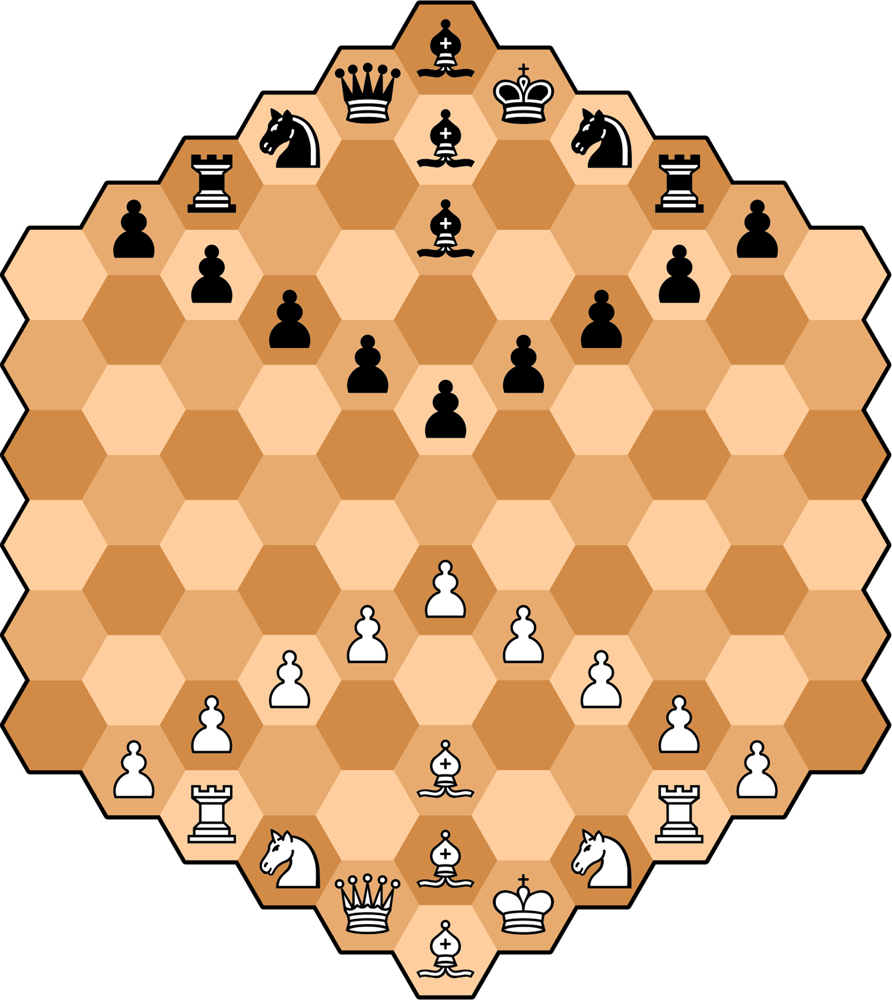

# Hexagonal Chess ♟️

HexChess is a modern take on traditional chess, invented in 1936 by Władysław Gliński and brought to the App Store by Sawyer Christensen. Designed to challenge experienced chess players with a unique hexagonal board, normal chess pattern recognition does not apply here. Being just as easy to learn as traditional chess, it levels the playing field between Grandmaster and Beginner.

https://en.wikipedia.org/wiki/Hexagonal_chess
